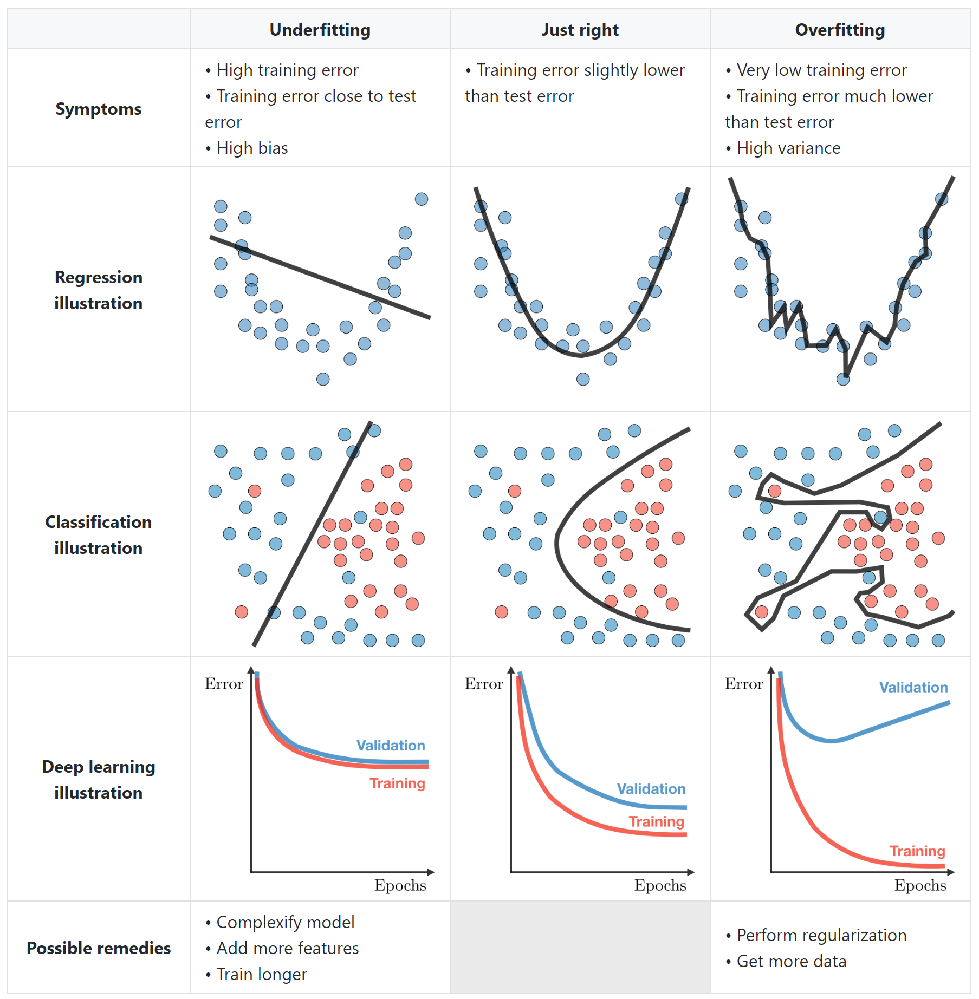

# Bias/Variance Tradeoff

## Bias

* Error between average model prediction and ground truth
* The bias of the estimated function tells us the capacity of the underlying model to predict the values

$$bias = \mathbb{E}[f'(x)] - f(x)$$

## Variance

* Average variability in the model prediction for the given dataset
* The variance of the estimated function tells you how much the function can adjust to the change in the dataset

$$variance = \mathbb{E}[(f'(x) - \mathbb{E}[f'(x)])^2]$$

**High Bias:**

* Overly simplified Model
* Under-fitting
* High error on both test and train data

**High Variance:**

* Overly complex Model
* Over-fitting
* Low error on train data and high on test
* Starts modelling the noise in the input

***

The bias-variance tradeoff is a fundamental concept in machine learning that helps us understand the tradeoff between two types of errors that a model can make: bias and variance. It's crucial to strike a balance between these two types of errors to create a model that generalizes well to new, unseen data.

**Bias** refers to the error due to overly simplistic assumptions in the learning algorithm. A high bias model might underfit the data, meaning it fails to capture the underlying patterns and relationships in the data, leading to poor performance on both the training and test sets.

**Variance** refers to the error due to the model's sensitivity to small fluctuations in the training data. A high variance model might overfit the data, meaning it fits the training data very well but fails to generalize to new data points, resulting in poor performance on the test set.

**Tradeoff Explanation with Example:**

Let's consider a simple example of fitting a polynomial to a set of data points. Imagine you have a set of data points that form a curve on a 2D plane. Your goal is to find a polynomial equation that fits these data points.

1. **High Bias, Low Variance:** Suppose you decide to fit a linear equation (a straight line) to the data points. This is a high bias model because it makes a simplistic assumption about the underlying relationship. As a result, the fitted line might not capture the curve's nuances, leading to a bias in predictions. However, this simple model is less sensitive to variations in the training data, so it might perform similarly on both the training and test sets.
2. **Low Bias, High Variance:** Now consider fitting a high-degree polynomial (e.g., a 10th-degree polynomial) to the data. This is a low bias model because it has the flexibility to closely follow the data points, even capturing their intricate details. However, this model is more sensitive to the noise and fluctuations in the training data, resulting in a high variance. It's likely to fit the training data extremely well but may not generalize to new data points, leading to poor performance on the test set.

Finding the right balance between bias and variance is crucial. You want a model that is complex enough to capture the underlying patterns but not overly complex to avoid fitting noise. This balance can be achieved by techniques like cross-validation, regularization, and choosing an appropriate model complexity based on the problem's nature and the available data.

In essence, the bias-variance tradeoff reminds us that while we aim to minimize both bias and variance, there's often a tradeoff between the two. The goal is to find the "sweet spot" where the model generalizes well to new data while still capturing the essential patterns in the training data.

<figure><figcaption>
<a href="https://stanford.edu/~shervine/teaching/cs-229/cheatsheet-machine-learning-tips-and-tricks">📖Source</a>
</figcaption></figure>

## Questions

High Bias

How can you identify a High Bias model? How can you fix it?

**Answer**

A **High Bias** model is due to a simple model and can be easily identified when you see:

1. High training error
2. Validation error or test error is the same as training error

To **fix** a High Bias model, you can:

1. Add more input features
2. Add more complexity by introducing polynomial features
3. Decrease the regularization term

Data Bias

Can you name a few types of data biases?

**Answer** [(Source)](https://www.telusinternational.com/articles/7-types-of-data-bias-in-machine-learning)

Though not exhaustive, this list contains common examples of data bias in the field, along with examples of where it occurs.

**Sample bias:** Sample bias occurs when a dataset does not reflect the realities of the environment in which a model will run. An example of this is certain facial recognition systems trained primarily on images of white men. These models have considerably lower levels of accuracy with women and people of different ethnicities. Another name for this bias is selection bias.

**Exclusion bias:** Exclusion bias is most common at the data preprocessing stage. Most often it's a case of deleting valuable data thought to be unimportant. However, it can also occur due to the systematic exclusion of certain information. For example, imagine you have a dataset of customer sales in America and Canada. 98% of the customers are from America, so you choose to delete the location data thinking it is irrelevant. However, this means you model will not pick up on the fact that your Canadian customers spend two times more.

**Measurement bias:** This type of bias occurs when the data collected for training differs from that collected in the real world, or when faulty measurements result in data distortion. A good example of this bias occurs in image recognition datasets, where the training data is collected with one type of camera, but the production data is collected with a different camera. Measurement bias can also occur due to inconsistent annotation during the data labeling stage of a project.

**Recall bias:** This is a kind of measurement bias, and is common at the data labeling stage of a project. Recall bias arises when you label similar types of data inconsistently. This results in lower accuracy. For example, let's say you have a team labeling images of phones as damaged, partially-damaged, or undamaged. If someone labels one image as damaged, but a similar image as partially damaged, your data will be inconsistent.

**Observer bias:** Also known as confirmation bias, observer bias is the effect of seeing what you expect to see or want to see in data. This can happen when researchers go into a project with subjective thoughts about their study, either conscious or unconscious. We can also see this when labelers let their subjective thoughts control their labeling habits, resulting in inaccurate data.

**Racial bias:** Though not data bias in the traditional sense, this still warrants mentioning due to its prevalence in AI technology of late. Racial bias occurs when data skews in favor of particular demographics. This can be seen in facial recognition and automatic speech recognition technology which fails to recognize people of color as accurately as it does caucasians.

**Association bias:** This bias occurs when the data for a machine learning model reinforces and/or multiplies a cultural bias. Your dataset may have a collection of jobs in which all men are doctors and all women are nurses. This does not mean that women cannot be doctors, and men cannot be nurses. However, as far as your machine learning model is concerned, female doctors and male nurses do not exist. Association bias is best known for creating gender bias.

KNN vs Bias/Variance

How can you relate the _KNN Algorithm_ to the _Bias-Variance tradeoff_?

**Answer** ([Source](https://teazrq.github.io/stat542/rlab/knn.html))

$$K$$ nearest neighbor is a simple nonparametric method.

Suppose we collect a set of observations $$(\{x_i, y_i\}_{i=1}^n)$$, the prediction at a new target point is $$\widehat y = \frac{1}{k} \sum_{x_i \in N_k(x_0)} y_i$$, where $$(N_k(x_0))$$ defines the $$(k)$$ samples from the training data that are closest to $$(x_0)$$. As default, closeness is defined using distance measures, such as the Euclidean distance.

If we consider different values of $$k$$, we can observe the trade-off between bias and variance.

&#x20;As $$k$$ increases, we have a more stable model, i.e., smaller variance, however, the bias is also increased. As $$k$$ decreases, the bias also decreases, but the model is less stable. Formally, the prediction error (at a given target point $$x_0$$) can be broken into three parts: the irreducible error, the bias squared, and variance.$$[\begin{aligned} E\Big[ \big( Y - \widehat f(x_0) \big)^2 \Big] &= E \Big[ \big( Y - f(x_0) + f(x_0) -  E[\widehat f(x_0)] + E[\widehat f(x_0)] - \widehat f(x_0) \big)^2 \Big] \\ &= E \Big[ \big( Y - f(x_0) \big)^2 \Big] + E \Big[ \big(f(x_0) -  E[\widehat f(x_0)] \big)^2 \Big] + E\Big[ \big(E[\widehat f(x_0)] - \widehat f(x_0) \big)^2 \Big] + \text{Cross Terms}\\ &= \underbrace{E\Big[ ( Y - f(x_0))^2 \big]}_{\text{Irreducible Error}} + \underbrace{\Big(f(x_0) - E[\widehat f(x_0)]\Big)^2}_{\text{Bias}^2} +  \underbrace{E\Big[ \big(\widehat f(x_0) - E[\widehat f(x_0)] \big)^2 \Big]}_{\text{Variance}} \end{aligned}]$$

