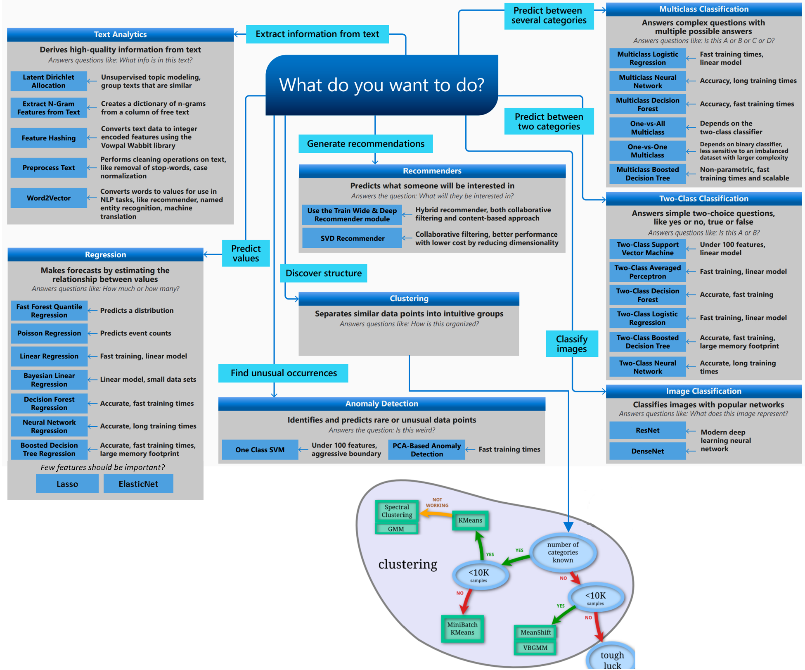

# Overview

As said in the very popular [The Hundred Page Machine Learning Book](https://themlbook.com/) each learning algorithm usually consists of three parts:

1. a loss function
2. an [optimization criterion](overview.md#optimization-criterion) based on the loss function (a cost function, for example)
3. an [optimization routine](overview.md#optimizers) that leverages training data to find a solution to the optimization criterion.&#x20;

These are the building blocks of any learning algorithm. Some algorithms were designed to explicitly optimize a specific criterion (both linear and logistic regressions, SVM). Some others, including decision tree learning and kNN, optimize the criterion implicitly. Decision tree learning and kNN are among the oldest machine learning algorithms and were invented experimentally based on intuition, without a specific global optimization criterion in mind, and (like it often happens in scientific history) the optimization criteria were developed later to explain why those algorithms work.

A common overview of different algorithms is given below:

<figure><figcaption>
Overview of Different Algorithms (<a href="https://learn.microsoft.com/en-us/azure/machine-learning/algorithm-cheat-sheet">Source</a>) (<a href="https://scikit-learn.org/stable/tutorial/machine_learning_map/">Source</a>)
</figcaption></figure>

### Optimization Criterion

Cost functions, also known as loss functions or objective functions, are used in data science to quantify the error or discrepancy between the predicted values generated by a model and the actual observed values in the dataset. The choice of a cost function depends on the specific type of problem you are trying to solve. Here are some common examples of cost functions used in data science:

1. **Mean Squared Error (MSE)**:
   * **Use Case**: Regression problems.
   * **Formula**: MSE = $$(1/n) Σ(y_i - ŷ_i)^2$$
   * **Description**: Measures the average squared difference between the predicted values (ŷ\_i) and the actual values (y\_i). Penalizes larger errors more.
2. **Mean Absolute Error (MAE)**:
   * **Use Case**: Regression problems.
   * **Formula**: MAE = $$(1/n) Σ|y_i - ŷ_i|$$
   * **Description**: Measures the average absolute difference between predicted and actual values. Less sensitive to outliers compared to MSE.
3. **Binary Cross-Entropy (Log Loss)**:
   * **Use Case**: Binary classification problems.
   * **Formula**: BCE = $$-Σ(y_i * log(ŷ_i) + (1 - y_i) * log(1 - ŷ_i))$$
   * **Description**: Evaluates the difference between predicted probabilities ($$ŷ_i$$) and actual binary labels ($$y_i$$). Commonly used with logistic regression and neural networks.
4. **Categorical Cross-Entropy (Multiclass Log Loss)**:
   * **Use Case**: Multiclass classification problems.
   * **Formula**: Cross-Entropy = $$-Σ(y_i * log(ŷ_i))$$
   * **Description**: Generalization of binary cross-entropy for multiple classes. Measures the dissimilarity between predicted class probabilities and actual class labels.
5. **Hinge Loss (SVM Loss)**:
   * **Use Case**: Support Vector Machines (SVM) for binary classification.
   * **Formula**: Hinge Loss = $$Σmax(0, 1 - y_i * ŷ_i)$$
   * **Description**: Encourages the correct classification of data points while allowing a margin of error for some misclassified points.
6. **Huber Loss**:
   * **Use Case**: Regression problems, robust to outliers.
   * **Formula**: Huber Loss = $$Σ{0.5 * (y_i - ŷ_i)^2 for |y_i - ŷ_i| ≤ δ} + Σ{δ * |y_i - ŷ_i| for |y_i - ŷ_i| > δ}$$
   * **Description**: Combines the properties of MSE and MAE by using a quadratic loss for small errors and linear loss for large errors. More robust to outliers.
7. **Kullback-Leibler Divergence (KL Divergence)**:
   * **Use Case**: Used in probabilistic models and when comparing probability distributions.
   * **Formula**: KL Divergence = $$Σ(p(x) * log(p(x) / q(x)))$$
   * **Description**: Measures the difference between two probability distributions, p(x) and q(x). Used in tasks like variational autoencoders and generative adversarial networks (GANs).
8. **Custom Loss Functions**:
   * **Use Case**: Tailored to specific problems.
   * **Description**: In some cases, custom loss functions are designed to address the unique requirements of a particular problem. For example, in recommendation systems, a loss function might be created to optimize recommendations based on user behavior.

The choice of a cost function depends on the nature of your data, the type of problem you're trying to solve, and your modeling goals. Selecting an appropriate cost function is a crucial step in designing and training machine learning models.

### Optimizers

Optimizers are algorithms used in data science and machine learning to adjust the parameters of a model during training to minimize the error or loss function. Each optimizer has its own way of updating these parameters, and they come with their own advantages and disadvantages.&#x20;

<figure><figcaption>
(<a href="https://www.analyticsvidhya.com/blog/2021/10/a-comprehensive-guide-on-deep-learning-optimizers/">Source</a>)
</figcaption></figure>

Here are some common optimizers explained in simple terms with their pros and cons:

1. **Gradient Descent**:
   * **How it works**: Gradient Descent computes the gradient (slope) of the loss function and takes small steps in the direction that reduces the loss.
   * **Pros**: Simple, widely used, and works well in many cases.
   * **Cons**: Can be slow to converge to the optimal solution, especially in high-dimensional spaces.
2. **Stochastic Gradient Descent (SGD)**:
   * **How it works**: Similar to Gradient Descent but updates parameters using a random subset (mini-batch) of the training data.
   * **Pros**: Faster convergence, works well with large datasets, and helps escape local minima.
   * **Cons**: Noisy updates can lead to oscillations, and it may require tuning of the learning rate.
3.  **Mini-Batch Gradient Descent**:

    * **How it works**: A compromise between Gradient Descent and SGD, where updates are made using small batches of data.
    * **Pros**: Faster than Gradient Descent, less noisy than SGD, and suitable for a wide range of problems.
    * **Cons**: Still requires tuning of the learning rate, and convergence depends on the batch size.

    <mark style="color:blue;">In the case of Stochastic Gradient Descent, we update the parameters after every single observation and we know that every time the weights are updated it is known as an iteration. In the case of Mini-batch Gradient Descent, we take a subset of data and update the parameters based on every subset.</mark>
4. **Adam (Adaptive Moment Estimation)**:
   * **How it works**: Combines ideas from RMSprop and Momentum methods by adapting the learning rates for each parameter based on past gradients.
   * **Pros**: Fast convergence, works well with noisy data, and requires less hyperparameter tuning.
   * **Cons**: Might not perform as well on all problem types and could converge to suboptimal solutions in some cases.
5. **RMSprop (Root Mean Square Propagation)**:
   * **How it works**: Adjusts the learning rate for each parameter based on the magnitude of recent gradients.
   * **Pros**: Effective in handling non-stationary or noisy environments, requires less tuning compared to traditional SGD.
   * **Cons**: Not suitable for all problem types and may converge to local minima.
6. **Adagrad (Adaptive Gradient Algorithm)**:
   * **How it works**: Adapts the learning rate for each parameter based on the historical gradient information.
   * **Pros**: Automatically adapts learning rates, which can be beneficial for sparse data.
   * **Cons**: Learning rates can become too small over time, causing slow convergence and potentially overshooting the optimal solution.
7. **Nadam**:
   * **How it works**: A combination of Nesterov Accelerated Gradient (NAG) and Adam optimizers, which combines their advantages.
   * **Pros**: Fast convergence, good for complex models, and less sensitive to the choice of hyperparameters.
   * **Cons**: Computationally more expensive than some other optimizers.

The choice of optimizer depends on the specific problem you are solving, the dataset size, and the architecture of your neural network. It's common to experiment with different optimizers and hyperparameters to find the one that works best for your particular task.
