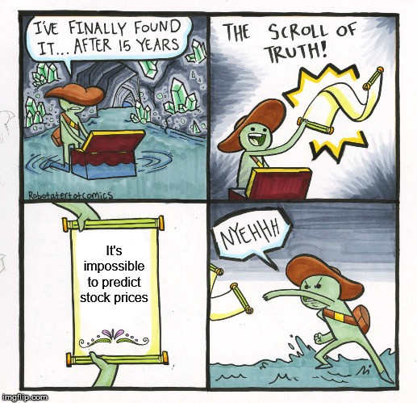
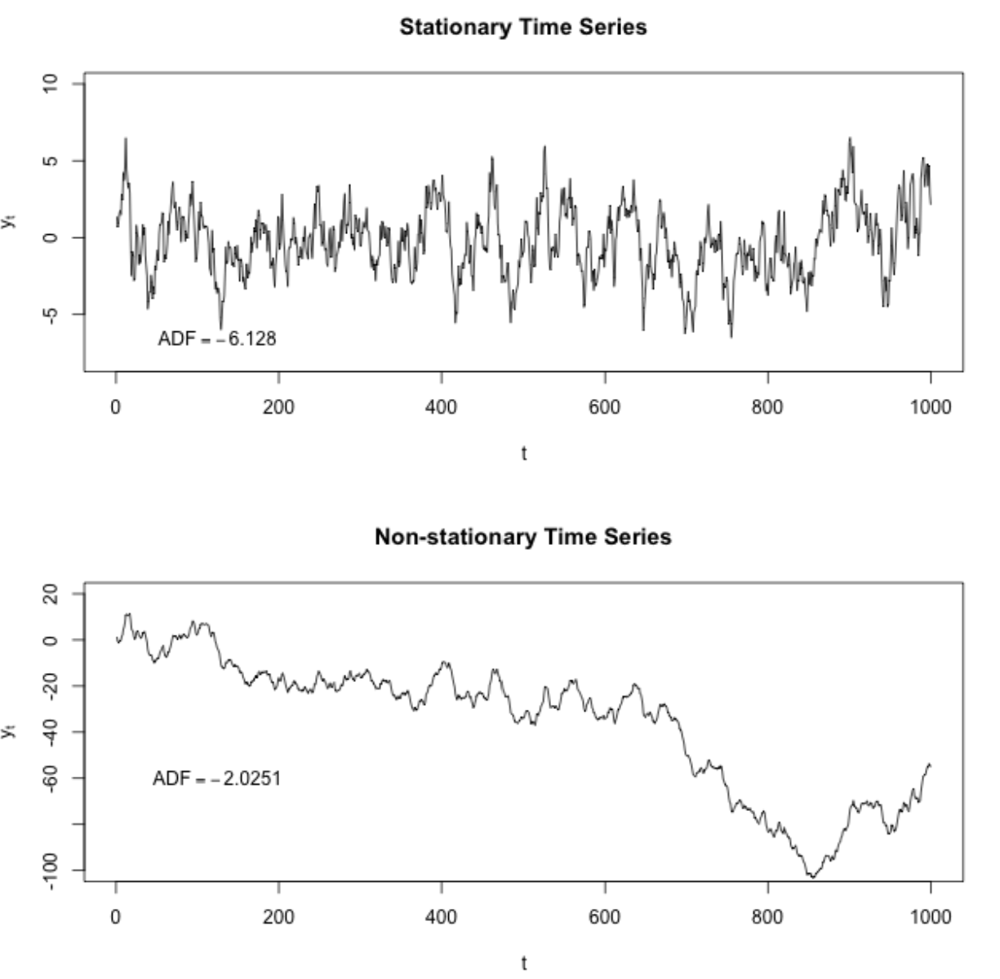
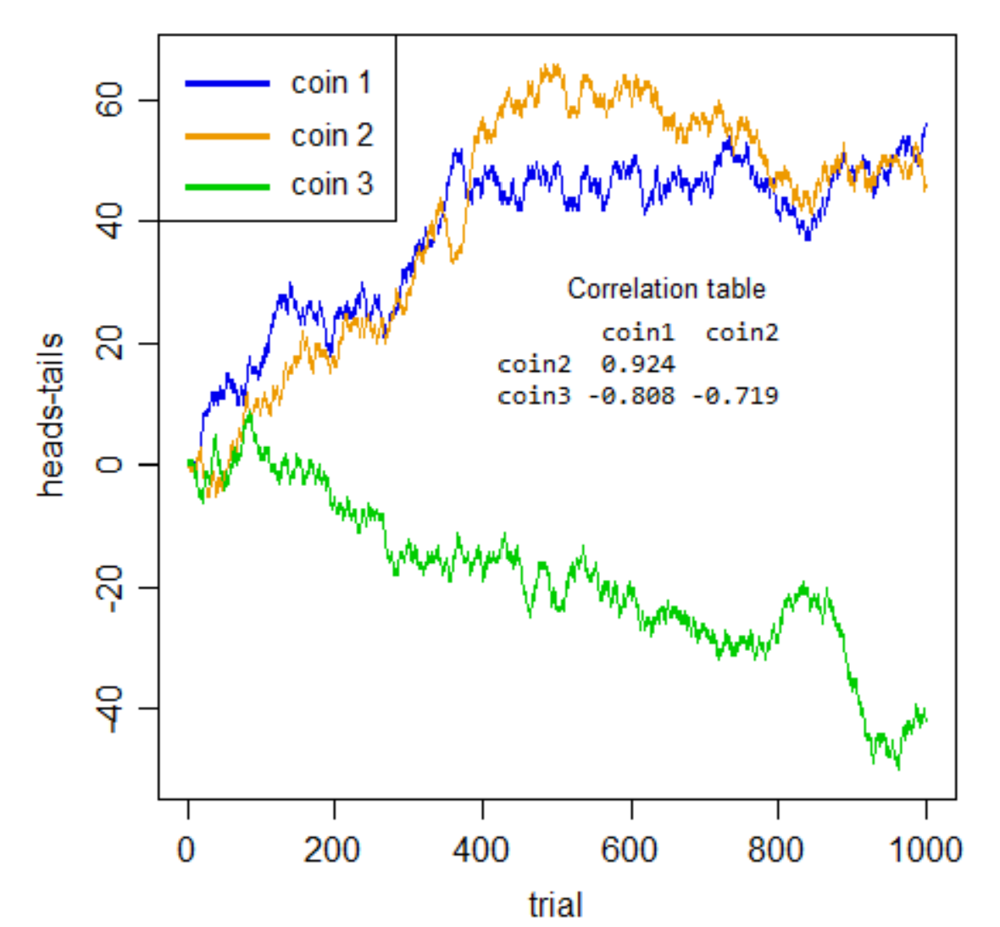

# Time Series Analysis

**Reference:** [📖Explanation](https://nbviewer.jupyter.org/github/Yorko/mlcourse\_open/blob/master/jupyter\_english/topic09\_time\_series/topic9\_part1\_time\_series\_python.ipynb)

<figure><figcaption></figcaption></figure>

A time series is simply a series of data points ordered in time. In a time series, time is often the independent variable and the goal is usually to make a forecast for the future.

* **Moving Average:** Here the assumption is that future value of our variable depends on the average of its $$k$$ previous values. Moving average has another use case - smoothing the original time series to identify trends. The wider the window, the smoother the trend. In the case of very noisy data, which is often encountered in finance, this procedure can help detect common patterns. This can also be used to determine anamolies based on the confidence level.
* **Weighted average:** It is a simple modification to the moving average. The weights sum up to `1` with larger weights assigned to more recent observations. $$\hat{y}_{t} = \displaystyle\sum^{k}_{n=1} \omega_n y_{t+1-n}$$
*   **Exponential smoothing:** Here instead of weighting the last $$k$$ values of the time series, we start weighting all available observations while exponentially decreasing the weights as we move further back in time. $$\hat{y}_{t} = \alpha \cdot y_t + (1-\alpha) \cdot \hat y_{t-1}$$

    The $$\alpha$$ weight is called a smoothing factor. It defines how quickly we will "forget" the last available true observation. The smaller $$\alpha$$ is, the more influence the previous observations have and the smoother the series is.
*   **Double Exponential smoothing:** Up to now, the methods that we've discussed have been for a single future point prediction (with some nice smoothing). That is cool, but it is also not enough. Let's extend exponential smoothing so that we can predict two future points (of course, we will also include more smoothing).

    Series decomposition will help us -- we obtain two components: intercept (i.e. level) $$\ell$$ and slope (i.e. trend) $$b$$. We have learnt to predict intercept (or expected series value) with our previous methods; now, we will apply the same exponential smoothing to the trend by assuming that the future direction of the time series changes depends on the previous weighted changes. As a result, we get the following set of functions:

    $$\ell_x = \alpha y_x + (1-\alpha)(\ell_{x-1} + b_{x-1})$$

    $$b_x = \beta(\ell_x - \ell_{x-1}) + (1-\beta)b_{x-1}$$

    $$\hat{y}_{x+1} = \ell_x + b_x$$

    The first one describes the intercept, which, as before, depends on the current value of the series. The second term is now split into previous values of the level and of the trend. The second function describes the trend, which depends on the level changes at the current step and on the previous value of the trend. In this case, the $$\beta$$ coefficient is a weight for exponential smoothing. The final prediction is the sum of the model values of the intercept and trend.
*   **Triple exponential smoothing a.k.a. Holt-Winters:**

    The idea is to add a third component - seasonality. This means that we should not use this method if our time series is not expected to have seasonality. Seasonal components in the model will explain repeated variations around intercept and trend, and it will be specified by the length of the season, in other words by the period after which the variations repeat. For each observation in the season, there is a separate component; for example, if the length of the season is 7 days (a weekly seasonality), we will have 7 seasonal components, one for each day of the week.

    The new system of equations:

    $$\ell_x = \alpha(y_x - s_{x-L}) + (1-\alpha)(\ell_{x-1} + b_{x-1})$$

    $$b_x = \beta(\ell_x - \ell_{x-1}) + (1-\beta)b_{x-1}$$

    $$s_x = \gamma(y_x - \ell_x) + (1-\gamma)s_{x-L}$$

    $$\hat{y}_{x+m} = \ell_x + mb_x + s_{x-L+1+(m-1)modL}$$

    The intercept now depends on the current value of the series minus any corresponding seasonal component. Trend remains unchanged, and the seasonal component depends on the current value of the series minus the intercept and on the previous value of the component. Take into account that the component is smoothed through all the available seasons; for example, if we have a Monday component, then it will only be averaged with other Mondays. You can read more on how averaging works and how the initial approximation of the trend and seasonal components is done [here](http://www.itl.nist.gov/div898/handbook/pmc/section4/pmc435.htm). Now that we have the seasonal component, we can predict not just one or two steps ahead but an arbitrary $$m$$ future steps ahead, which is very encouraging.

    Below is the code for a triple exponential smoothing model, which is also known by the last names of its creators, Charles Holt and his student Peter Winters. Additionally, the Brutlag method was included in the model to produce confidence intervals:

    $$\hat y_{max_x}=\ell_{x−1}+b_{x−1}+s_{x−T}+m⋅d_{t−T}$$

    $$\hat y_{min_x}=\ell_{x−1}+b_{x−1}+s_{x−T}-m⋅d_{t−T}$$

    $$d_t=\gamma∣y_t−\hat y_t∣+(1−\gamma)d_{t−T},$$

    where $$T$$ is the length of the season, $$d$$ is the predicted deviation. Other parameters were taken from triple exponential smoothing. You can read more about the method and its applicability to anomaly detection in time series [here](http://fedcsis.org/proceedings/2012/pliks/118.pdf).

    Exponentiality is hidden in the recursiveness of the function – we multiply by $$(1-\alpha)$$ each time, which already contains a multiplication by $$(1-\alpha)$$ of previous model values.

### Stationarity

Before we start modeling, we should mention such an important property of time series, **stationarity**.

So why is stationarity so important? Because it is easy to make predictions on a stationary series since we can assume that the future statistical properties will not be different from those currently observed. Most of the time-series models, in one way or the other, try to predict those properties (mean or variance, for example). Furture predictions would be wrong if the original series were not stationary.

When running a linear regression the assumption is that all of the observations are all independent of each other. In a time series, however, we know that observations are time dependent. It turns out that a lot of nice results that hold for independent random variables (law of large numbers and central limit theorem to name a couple) hold for stationary random variables. So by making the data stationary, we can actually apply regression techniques to this time dependent variable.

**Dickey-Fuller test** can be used as a check for stationarity. If ‘Test Statistic’ is greater than the ‘Critical Value’ then the time series is stationary.

There are a few ways to deal with non-stationarity:

* Deflation by CPI
* Logarithmic
* First Difference
* Seasonal Difference
* Seasonal Adjustment

Plot the ACF and PACF charts and find the optimal parameters.

### ARIMA family

We will explain this model by building up letter by letter. $$SARIMA(p, d, q)(P, D, Q, s)$$, Seasonal Autoregression Moving Average model:

* $$AR(p)$$ - autoregression model i.e. regression of the time series onto itself. The basic assumption is that the current series values depend on its previous values with some lag (or several lags). The maximum lag in the model is referred to as $$p$$. To determine the initial $$p$$, you need to look at the PACF plot and find the biggest significant lag after which **most** other lags become insignificant.
* $$MA(q)$$ - moving average model. Without going into too much detail, this models the error of the time series, again with the assumption that the current error depends on the previous with some lag, which is referred to as $$q$$. The initial value can be found on the ACF plot with the same logic as before.

Let's combine our first 4 letters:

$$AR(p) + MA(q) = ARMA(p, q)$$

What we have here is the Autoregressive–moving-average model! If the series is stationary, it can be approximated with these 4 letters. Let's continue.

* $$I(d)$$ - order of integration. This is simply the number of nonseasonal differences needed to make the series stationary.

Adding this letter to the four gives us the $$ARIMA$$ model which can handle non-stationary data with the help of nonseasonal differences. Great, one more letter to go!

* $$S(s)$$ - this is responsible for seasonality and equals the season period length of the series

With this, we have three parameters: $$(P, D, Q)$$

* $$P$$ - order of autoregression for the seasonal component of the model, which can be derived from PACF. But you need to look at the number of significant lags, which are the multiples of the season period length. For example, if the period equals 24 and we see the 24-th and 48-th lags are significant in the PACF, that means the initial $$P$$ should be 2.
* $$Q$$ - similar logic using the ACF plot instead.
* $$D$$ - order of seasonal integration. This can be equal to 1 or 0, depending on whether seasonal differeces were applied or not.

### Prophet

[📖 Check out this discussion](https://stats.stackexchange.com/questions/472266/inference-in-time-series-prophet-vs-arima)

ARIMA and similar models assume some sort of causal relationship between past values and past errors and future values of the time series. Facebook Prophet doesn't look for any such causal relationships between past and future. Instead, it simply tries to find the best curve to fit to the data, using a linear or logistic curve, and Fourier coefficients for the seasonal components. There is also a regression component, but that is for external regressors, not for the time series itself (The Prophet model is a special case of GAM - Generalized Additive Model).

### Metrics

* **R squared:** coefficient of determination (in econometrics, this can be interpreted as the percentage of variance explained by the model), $$(-\infty, 1]$$

$$R^2 = 1 - \frac{SS_{res}}{SS_{tot}}$$

* **Mean Absolute Error:** this is an interpretable metric because it has the same unit of measurment as the initial series, $$[0, +\infty)$$

$$MAE = \frac{\sum\limits_{i=1}^{n} |y_i - \hat{y}_i|}{n}$$

* **Median Absolute Error:** again, an interpretable metric that is particularly interesting because it is robust to outliers, $$[0, +\infty)$$

$$MedAE = median(|y_1 - \hat{y}_1|, ... , |y_n - \hat{y}_n|)$$

* **Mean Squared Error:** the most commonly used metric that gives a higher penalty to large errors and vice versa, $$[0, +\infty)$$

$$MSE = \frac{1}{n}\sum\limits_{i=1}^{n} (y_i - \hat{y}_i)^2$$

* **Mean Squared Logarithmic Error:** practically, this is the same as MSE, but we take the logarithm of the series. As a result, we give more weight to small mistakes as well. This is usually used when the data has exponential trends, $$[0, +\infty)$$

$$MSLE = \frac{1}{n}\sum\limits_{i=1}^{n} (log(1+y_i) - log(1+\hat{y}_i))^2$$

* **Mean Absolute Percentage Error:** this is the same as MAE but is computed as a percentage, which is very convenient when you want to explain the quality of the model to management, $$[0, +\infty)$$

$$MAPE = \frac{100}{n}\sum\limits_{i=1}^{n} \frac{|y_i - \hat{y}_i|}{y_i}$$

***

### Questions

<details>

<summary>Cross Validation with Time Series</summary>

Can cross validation be used with Time Series to estimate model parameters automatically?

**Answer**

Normal cross-validation cannot be used for time series because one cannot randomly mix values in a fold while preserving this structure. With randomization, all time dependencies between observations will be lost. But something like "cross-validation on a rolling basis" can be used.

The idea is rather simple -- we train our model on a small segment of the time series from the beginning until some $$t$$, make predictions for the next $$t+n$$ steps, and calculate an error. Then, we expand our training sample to $$t+n$$ value, make predictions from $$t+n$$ until $$t+2*n$$, and continue moving our test segment of the time series until we hit the last available observation. As a result, we have as many folds as $$n$$ will fit between the initial training sample and the last observation.

</details>

<details>

<summary>CNNs in Time Series</summary>

How are CNNs used for Time Series Prediction?

**Answer**

* The ability of CNNs to learn and automatically extract features from raw input data can be applied to time series forecasting problems. A sequence of observations can be treated like a one-dimensional image that a CNN model can read and distill into the most salient elements.
* The capability of CNNs has been demonstrated to great effect on time series classification tasks such as automatically detecting human activities based on raw accelerator sensor data from fitness devices and smartphones.
* CNNs have the support for multivariate input, multivariate output, it can learn arbitrary but complex functional relationships, but does not require that the model learn directly from lag observations. Instead, the model can learn a representation from a large input sequence that is most relevant for the prediction problem.

</details>

<details>

<summary>Data Prep for Time Series</summary>

What are some of Data Preprocessing Operations you would use for Time Series Data?

**Answer**

It depends on the problem, but some common ones are:

* Parsing time series information from various sources and formats.
* Generating sequences of fixed-frequency dates and time spans.
* Manipulating and converting date times with time zone information.
* Resampling or converting a time series to a particular frequency.
* Performing date and time arithmetic with absolute or relative time increments.

</details>

<details>

<summary>Missing Value in Time Series</summary>

What are some of best ways to handle missing values in Time Series Data?

**Answer**

The most common methodology used for handling missing, unequally spaced, or unsynchronized values is _linear interpolation_.

The idea is to create estimated values at the desired time stamps. These can be used to generate multivariate time series that are synchronized, equally spaced, and have no missing values. Consider the scenario where $$y_i$$ and $$y_j$$ are values for the time series at times $$t_i$$ and $$t_j$$, repectively, where $$i < j$$. Let $$t$$ be a time drawn from the interval $$(t_i, t_j)$$. Then, the interpolated value of the series is given by: $$y = y_i + \frac{t-t_i}{t_j-t_i}*(y_j-y_i)$$

</details>

<details>

<summary>Stationarity</summary>

Can you explain why time series has to be stationary?

**Answer**

Stationarity is important because, in its absence, a model describing the data will vary in accuracy at different time points. As such, stationarity is required for sample statistics such as means, variances, and correlations to accurately describe the data at all time points of interest.

Looking at the time series plots below, you can notice how the mean and variance of any given segment of time would do a good job representing the whole stationary time series but a relatively poor job representing the whole non-stationary time series. For instance, the mean of the non-stationary time series is much lower from $$600<t<800$$ and its variance is much higher in this range than in the range from $$200<t<400$$.



What quantities are we typically interested in when we perform statistical analysis on a time series? We want to know

* Its expected value,
* Its variance, and
* The correlation between values $$s$$ periods apart for a set of values.

To calculate these things we use a mean across many time periods. The mean across many time periods is only informative if the expected value is the same across those time periods. If these population parameters can vary, what are we really estimating by taking an average across time?

(Weak) stationarity requires that these population quantities must be the same across time, making the sample average a reasonable way to estimate them.

</details>

<details>

<summary>IQR in Time Series</summary>

How is Interquartile range used in Time series?

**Answer**

It is mostly used to detect outliers in Time Series data.

</details>

<details>

<summary>Irregular Data</summary>

What does irregularly-spaced spatial data mean in Time series?

**Answer**

* A lot of techniques assume that data is sampled at regularly-spaced intervals of time. This interval between adjacent samples is called the _sampling period_.
* A lot of data is not or cannot be sampled with a fixed sampling period. For example, if we measure the atmosphere using sensors, the terrain may not allow us to place weather stations exactly 50 miles apart.

There are many different ways to deal with this kind of data which does not have a fixed sampling period. One approach is to interpolate the data onto a grid and then use a technique intended for gridded data.

</details>

<details>

<summary>Sliding Window</summary>

Explain the Sliding Window method in Time series?

**Answer**

* Time series can be phrased as supervised learning. Given a sequence of numbers for a time series dataset, we can restructure the data to look like a supervised learning problem.
* In the sliding window method, the previous time steps can be used as input variables, and the next time steps can be used as the output variable.

In statistics and time series analysis, this is called a lag or lag method. The number of previous time steps is called the window width or size of the lag. This sliding window is the basis for how we can turn any time series dataset into a supervised learning problem.

</details>

<details>

<summary>LSTM vs MLP</summary>

Can you discuss on the usage of LSTM vs MLP in Time Series?

**Answer**

Multilayer Perceptrons, or MLPs for short, can be applied to time series forecasting. A challenge with using MLPs for time series forecasting is in the preparation of the data. Specifically, lag observations must be flattened into feature vectors. My understanding is that LSTMs captures the relations between time steps, whereas simple MLPs treat each time step as a separated feature (doesn't take succession into consideration).

RNNs are known to be superior to MLP in case of sequential data. But complex models like LSTM and GRU require a lot of data to achieve their potential.

</details>

<details>

<summary>Sequential vs Non-Sequential</summary>

Can a CNN (or other non-sequential deep learning models) outperform LSTM (or other sequential models) in time series data

**Answer**

[_Source_](https://ai.stackexchange.com/questions/16818/can-non-sequential-deep-learning-models-outperform-sequential-models-in-time-ser)

You are right CNN based models can outperform RNN. You can take a look at this [paper](https://arxiv.org/pdf/1803.01271.pdf) where they compared different RNN models with TCN (temporal convolutional networks) on different sequence modeling tasks. Even though there are no big differences in terms of results there are some nice properties that CNN based models offers such as: parallelism, stable gradients and low training memory footprint. In addition to CNN based models there are also attention based models (you might want to take a look at the [transformer](https://papers.nips.cc/paper/7181-attention-is-all-you-need.pdf))

</details>

<details>

<summary>Long Time Series</summary>

What's the best architecture for time series prediction with a long dataset?

**Answer**

[_Source_](https://ai.stackexchange.com/questions/17802/whats-the-best-architecture-for-time-series-prediction-with-a-long-dataset)

LSTM is ideal for this. For even stronger representational capacity, make your LSTM's multi-layered. Using 1-dimensional convolutions in a CNN is a common way to exctract information from time series too, so there's no harm in trying. Typically, you'll test many models out and take the one that has best validation performance.

</details>

<details>

<summary>Correlation</summary>

How to use Correlation in Time series data?

**Answer**

[_Source_](https://stats.stackexchange.com/questions/133155/how-to-use-pearson-correlation-correctly-with-time-series)

Pearson correlation is used to look at correlation between series ... but being time series, the correlation is looked at across different lags -- the cross-correlation function. The cross-correlation is impacted by dependence within-series, so in many cases the within-series dependence should be removed first. So, to use this correlation, rather than smoothing the series, it's actually more common (because it's meaningful) to look at dependence between residuals - the rough part that's left over after a suitable model is found for the variables.

You probably want to begin with some basic resources on time series models before delving into trying to figure out whether a Pearson correlation across (presumably) nonstationary, smoothed series is interpretable.

In particular, you'll probably want to look into spurious correlation. The point about spurious correlation is that series can appear correlated, but the correlation itself is not meaningful. Consider two people tossing two distinct coins counting number of heads so far minus number of tails so far as the value of their series.

(So, if person-1 tosses $$HTHH$$... they have $$3-1 = 2$$ for the value at the $$4^{th}$$ time step, and their series goes $$1,0,1,2,....$$)

Obviously, there's no connection whatever between the two series. Clearly neither can tell you the first thing about the other!

But look at the sort of correlations you get between pairs of coins:



If I didn't tell you what those were, and you took any pair of those series by themselves, those would be impressive correlations would they not?

But they're all meaningless. Utterly spurious. None of the three pairs are really any more positively or negatively related to each other than any of the others -- it's just cumulated noise. The spuriousness isn't just about prediction, the whole notion of considering association between series without taking account of the within-series dependence is misplaced.

All you have here is within-series dependence. There's no actual cross-series relation whatever.

Once you deal properly with the issue that makes these series auto-dependent - they're all integrated (Bernoulli random walks), so you need to difference them - the "apparent" association disappears (the largest absolute cross-series correlation of the three is 0.048).

What that tells you is the truth -- the apparent association is a mere illusion caused by the dependence within-series.

If your question asked "_how to use Pearson correlation correctly with time series_" -- so please understand: if there's within-series dependence and you don't deal with it first, you won't be using it correctly.

Further, smoothing won't reduce the problem of serial dependence; quite the opposite -- it makes it even worse! Here are the correlations after smoothing (default loess smooth - of series vs index - performed in R):

```
|       | coin1      | coin2      |
|-------|------------|------------|
| coin2 | 0.9696378  |            |
| coin3 | -0.8829326 | -0.7733559 |
```

They all got further from 0. They're all still nothing but meaningless noise, though now it's smoothed, cumulated noise. (By smoothing, we reduce the variability in the series we put into the correlation calculation, so that may be why the correlation goes up.)

_Check the link given above for a detailed discussion_

</details>

<details>

<summary>State Space Model and Kalman Filtering</summary>

Describe in details how State Space Model and Kalman Filtering are used in Time Series forecasting?

**Answer**

[_Resource_](https://www.google.com/url?sa=t\&rct=j\&q=\&esrc=s\&source=web\&cd=\&cad=rja\&uact=8\&ved=2ahUKEwjDh\_W1\_dD6AhWU-DgGHY5OAlMQFnoECBMQAQ\&url=https%3A%2F%2Ftowardsdatascience.com%2Fstate-space-model-and-kalman-filter-for-time-series-prediction-basic-structural-dynamic-linear-2421d7b49fa6\&usg=AOvVaw0u-sCm-kITU5I-Ptdc9K8s) \_\_ [_Source_](https://mfe.baruch.cuny.edu/wp-content/uploads/2014/12/TS\_Lecture5\_2019.pdf)

A state space model (SSM) is a time series model in which the time series $$Y_t$$ is interpreted as the result of a noisy observation of a stochastic process $$X_t$$. The values of the variables $$X_t$$ and $$Y_t$$ can be continuous (scalar or vector) or discrete. Graphically, an SSM is represented as follows:


SSMs belong to the realm of Bayesian inference, and they have been successfully applied in many fields to solve a broad range of problems. It is usually assumed that the state process $$X_t$$ is Markovian. The most well studied SSM is the Kalman filter, for which the processes above are linear and the sources of randomness are Gaussian.

Let $$T$$ denote the time horizon. Our broad goal is to make inference about the states Xt based on a set of observations $$Y_1, . . . , Y_t$$. Three questions are of particular interest:

* **Filtering:** $$t < T$$. What can we infer about the current state of the system based on all available observations?
* **Smoothing:** $$t = T$$. What can be inferred about the system based on the information contained in the entire data sample? In particular, how can we back fill missing observations?
* **Forecasting:** $$t > T$$. What is the optimal prediction of a future observation and/or a future state of the system?

In principle, any inference for this model can be done using the standard methods of multivariate statistics. However, these methods require storing large amounts of data and inverting $$tn × tn$$ matrices. Notice that, as new data arrive, the storage requirements and matrix dimensionality increase. This is frequently computationally intractable and impractical. Instead, the Kalman filter relies on a recursive approach which does not require significant storage resources and involves inverting $$n × n$$ matrices only.

</details>

<details>

<summary>State Space Model vs Conventional Methodologies</summary>

What are disadvantages of state-space models and Kalman Filter for time-series modelling over let's say conventional methodologies like ARIMA, VAR or ad-hoc/heuristic methods?

**Answer**

[_Source_](https://stats.stackexchange.com/questions/78287/what-are-disadvantages-of-state-space-models-and-kalman-filter-for-time-series-m)

* Overall - compared to ARIMA, state-space models allow you to model more complex processes, have interpretable structure and easily handle data irregularities; but for this you pay with increased complexity of a model, harder calibration, less community knowledge.
* ARIMA is a universal approximator - you don't care what is the true model behind your data and you use universal ARIMA diagnostic and fitting tools to approximate this model. It is like a polynomial curve fitting - you don't care what is the true function, you always can approximate it with a polynomial of some degree.
* State-space models naturally require you to write-down some reasonable model for your process (which is good - you use your prior knowledge of your process to improve estimates). Of course, if you don't have any idea of your process, you always can use some universal state-space model also - e.g. represent ARIMA in a state-space form. But then ARIMA in its original form has more parsimonious formulation - without introducing unnecessary hidden states.
* Because there is such a great variety of state-space models formulations (much richer than class of ARIMA models), behavior of all these potential models is not well studied and if the model you formulated is complicated - it's hard to say how it will behave under different circumstances. Of course, if your state-space model is simple or composed of interpretable components, there is no such problem. But ARIMA is always the same well studied ARIMA so it should be easier to anticipate its behavior even if you use it to approximate some complex process.
* Because state-space allows you directly and exactly model complex/nonlinear models, then for these complex/nonlinear models you may have problems with stability of filtering/prediction (EKF/UKF divergence, particle filter degradation). You may also have problems with calibrating complicated-model's parameters - it's a computationally-hard optimization problem. ARIMA is simple, has less parameters (1 noise source instead of 2 noise sources, no hidden variables) so its calibration is simpler.
* For state-space there is less community knowledge and software in statistical community than for ARIMA.

</details>

<details>

<summary>Discrete Wavelet Transform</summary>

Have you heard of Discrete Wavelet Transform in time series?

**Answer**

[_Source_](https://stackoverflow.com/questions/68303601/wavelet-for-time-series)

A Discrete Wavelet Transform (DWT) allows you to decompose your input data into a set of discrete levels, providing you with information about the frequency content of the signal i.e. determining whether the signal contains high frequency variations or low frequency trends. Think of it as applying several band-pass filters to your input data.

</details>
