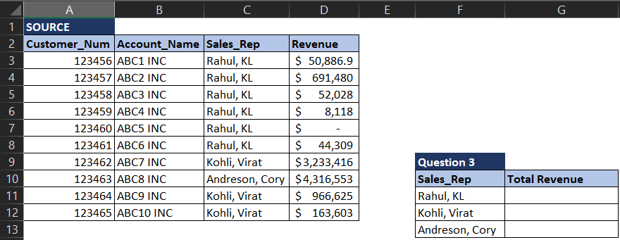

# Excel Basics

<figure><figcaption></figcaption></figure>

***

## Questions

<details>

<summary>Find Revenue</summary>

From the source below can you find the Revenue the specified account?&#x20;


**Answer**

This can be solved with a simple VLOOKUP

```
=VLOOKUP(F3,B2:D12,3,FALSE)
```

</details>

<details>

<summary>Find Customer Number</summary>

From the source below can you find the Customer Number corresponding to the Account Name?

&#x20;

**Answer**

VLOOKUP won't work as Customer Num is to the LEFT of the Account Name. We need INDEX MATCH [📖Explanation](https://exceljet.net/index-and-match)

```
=INDEX(A2:D12,MATCH(F7,B2:B12),1)
```

</details>

<details>

<summary>Total Revenue</summary>

From the source below can you find the total revenue per sales rep? 

**Answer**

This can be solved with a simple SUMIF. For the first row the answer is given below. It will be similar for other rows.

```
=SUMIF(C3:C12,"="&F11,D3:D12)
```

</details>
