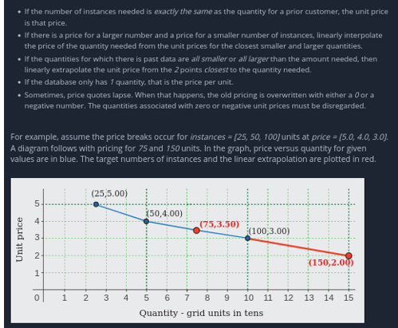

# Statistics

## Questions

<details>

<summary>JOIN Dataframes</summary>

Can you tell me the ways in which 2 pandas data frames can be joined?

**Answer**

* merge() is used to combine two (or more) dataframes on the basis of values of common columns (indices can also be used, use left\_index=True and/or right\_index=True)
* concat() is used to append one (or more) dataframes one below the other (or sideways, depending on whether the axis option is set to 0 or 1).
* join() is used to merge 2 dataframes on the basis of the index; instead of using merge() with the option left\_index=True we can use join().

</details>

<details>

<summary>[GOOGLE] Normal Distribution</summary>

Write a function to generate N samples from a normal distribution and plot the histogram.

**Answer**

```python
import numpy as np
import numpy as np
import matplotlib.pyplot as plt

def generate_samples(n, mean, std):
  """Generates N samples from a normal distribution with mean `mean` and standard deviation `std`."""
  return np.random.normal(mean, std, n)

def plot_histogram(samples):
  """Plots a histogram of the given samples."""
  plt.hist(samples, bins=100)
  plt.show()

# Generate 100 samples from a normal distribution with mean 0 and standard deviation 1.
samples = generate_samples(1000, 0, 1)

# Plot the histogram of the samples.
plot_histogram(samples)
```

</details>

<details>

<summary>[UBER] Bernoulli trial generator</summary>

Given a random Bernoulli trial generator, write a function to return a value sampled from a normal distribution.

**Answer**

```python
# *Solution recieved from the community via [merge request](https://github.com/dipranjan/dsinterviewqns/pull/5)*

import numpy as np
import pandas as pd
import matplotlib.pyplot as plt

# straightforward using the central limit theorem.

p = .5
n = 10000

# returns standard normal output via the central limit theorem
def standard_normal_output(p,n):
    bernoulli_mean = p
    bernoulli_variance = p*(1-p)
    bernoulli_std = abs(np.sqrt(bernoulli_variance))
    sample = np.random.binomial(size = n, n = 1, p = p)
    return (sample.mean() - bernoulli_mean)/(bernoulli_std/np.sqrt(n))

# now we plot this output 10000 times to indeed show it is a standard normal distribution
def plot_output():
    outputs=[]
    for i in range(0,n):
        outputs.append(standard_normal_output(p=p,n=n))
    num_bins = 20
    plt.hist(outputs, bins=num_bins, facecolor='blue', alpha=0.5)
    plt.show() 
plot_output()
```

</details>

<details>

<summary>[PINTEREST] Interquartile Distance</summary>

Given an array of unsorted random numbers (decimals) find the interquartile distance.

**Answer**

```python
# Interquartile distance is the difference between first and third quartile

# first let's generate a list of random numbers

import random
import numpy as np

li = [round(random.uniform(33.33, 66.66), 2) for i in range(50)]
print(li)

qtl_1 = np.quantile(li,.25)
qtl_3 = np.quantile(li,.75)

print("Interquartile distance: ", qtl_1 - qtl_3)
```

</details>

<details>

<summary>[GENENTECH] Imputing the median</summary>

Write a function cheese\_median to impute the median price of the selected California cheeses in place of the missing values. You may assume at least one cheese is not missing its price.

**Answer**

```python
import pandas as pd

cheeses = {"Name": ["Bohemian Goat", "Central Coast Bleu", "Cowgirl Mozzarella", "Cypress Grove Cheddar", "Oakdale Colby"], "Price" : [15.00, None, 30.00, None, 45.00]}

df_cheeses = pd.DataFrame(cheeses)
```

</details>

<details>

<summary>Show the Central Limit Theorem</summary>

In order to do this we will start with a non-normal distribution example the uniform distribution. Next, we will sample that distribution and get the mean of the sample, we will do this repeatedly. As per the central limit theorem the plot of the means will resemble a normal distribution.

**Answer**

```python
import numpy as np
import pandas as pd
import matplotlib.pyplot as plt

def sampling(n):
    # Create sample from uniform distribution
    sample = np.random.uniform(size=n, low = 1, high = 6)
    return sample.mean() #3.5 subtract the population mean if you want mean=0 for the normal distribution

# now we sample this 10000 times to indeed show it is a standard normal distribution
def plot_output(n):
    outputs=[]
    for i in range(0,n):
        outputs.append(sampling(30))
    num_bins = 20
    plt.hist(outputs, bins=num_bins, facecolor='blue', alpha=0.5)
    plt.title("Sample")
    plt.show() 

plot_output(10000)

```

&#x20;

</details>
