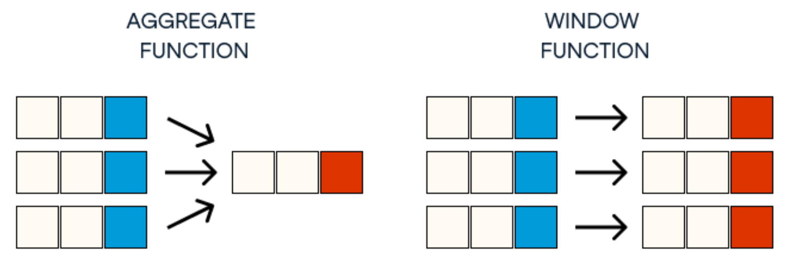

# Windows Functions


Since solving any reasonable SQL problem requires a combination of all the topics covered here, hence it becomes difficult to seggregate problems based on one topic alone. So for SQL we are creating a dedicated **Problems** section. Theoretical and Basic questions will still be under their dedicated sections.


**Reference:** [📖Explanation](https://www.red-gate.com/simple-talk/sql/t-sql-programming/introduction-to-t-sql-window-functions/), [🔫Playground](https://dbfiddle.uk/?rdbms=sqlserver\_2017\&fiddle=6379904805d1f465cc0f6ea33fc3c0d6)

Window (also, windowing or windowed) functions perform a calculation over a set of rows. I like to think of “looking through the window” at the rows that are being returned and having one last chance to perform a calculation. The window is defined by the OVER clause which determines if the rows are partitioned into smaller sets and if they are ordered. They allow you to add your favourite aggregate function to a non-aggregate query. Similar to Transform is pandas group by clause.

<figure><figcaption>
GROUP vs WINDOW
</figcaption></figure>

## Common Windows Functions

* **Ranking functions**
  * **ROW\_NUMBER:** is used to add unique row numbers to a partition or to the entire result set. It has the ability to turn non-unique rows into unique rows
  * **RANK:** it will give numbers same as row\_number just that same data will get same rank
  * **DENSE\_RANK:** doesnot skip and rank number
  * **NTILE:** It assigns bucket numbers to the rows instead of row numbers or ranks

<figure><figcaption>
Ranking functions, check playground to work with this
</figcaption></figure>

* **Offset functions**
  * **LAG:** the function allows you to pull columns or expressions from a row before the current row
  * **LEAD:** the function allows you to pull columns or expressions from a row after the current row
  * **FIRST\_VALUE:** the functions allows you to return values from the first row of the partition
  * **LAST\_VALUE:** the functions allows you to return values from the last row of the partition
* **Statistical functions** – **PERCENT\_RANK:** returns the percentage of rows that rank lower than the current row, its formula is $$\frac{\text{Rank} -1}{\text{Row count} -1}$$
  * **CUME\_DIST:** cumulative distribution, returns the exact rank, its formula is $$\frac{\text{Rank}}{\text{Row count}}$$
  * **PERCENTILE\_DISC & PERCENTILE\_CONT:** these two work in the opposite way. Given a percent rank, find the value at that rank. They differ in that PERCENTILE\_DISC will return a value that exists in the set while PERCENTILE\_CONT will calculate an exact value if none of the values in the set falls precisely at that rank. You can use PERCENTILE\_CONT to calculate a median by supplying 0.5 as the percent rank. For example, which temperature ranks at 50% in St. Louis?


One problem is you cannot add window functions to the WHERE clause. But certain Data Bases like TeraData, Snowflake, Databricks, Big Query, etc. have support for something called QUALIFY. Let's take an example to understand the difference:

In traditional SQL you will write the below SQL:

`select * from (SELECT Product, Region, Revenue, ROW_NUMBER() OVER (PARTITION BY Region ORDER BY Revenue DESC) as rn FROM Sales ) where rn=1`

Here's how you can use the QUALIFY keyword to achieve this:

`SELECT Product, Region, Revenue FROM Sales QUALIFY ROW_NUMBER() OVER (PARTITION BY Region ORDER BY Revenue DESC) = 1;`



Remember you CAN include window function and GROUP BY in the same statement, in such case the WINDOW function is evaluated _after_ GROUP BY. _As an example, below we can get both the user2 count at a user1 level along with total number of users in the table in the same query:_

<pre class="language-sql"><code class="lang-sql">select user1 
, 100*(<a data-footnote-ref href="#user-content-fn-1">CAST(count(distinct(user2)</a>) as FLOAT)/CAST (<a data-footnote-ref href="#user-content-fn-2">count(*) over () as FLOAT</a>)) as popularity_percent
from facebook_friends
group by user1
</code></pre>


[^1]: GROUP BY

[^2]: WINDOW function
