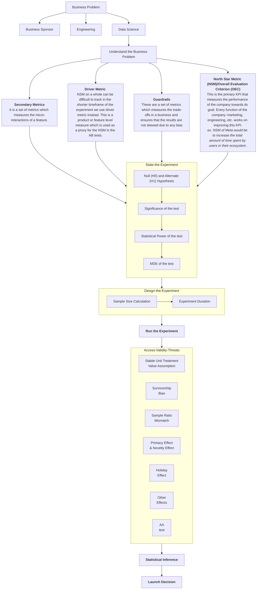

# ⚠ A/B test

### Metrics

We should also understand a few key terms in A/B testing before diving in:

1. **North Star Metric (NSM):** It is also known as Overall Evaluation Criterion (OEC). This is the primary KPI that measures the performance of the company towards its goal. For example, the NSM of Meta would be to increase the total amount of time spent by users in their ecosystem. Every function of the company — marketing, engineering, etc. works on improving this KPI.
2. **Driver Metric:** Since NSM can be difficult to track in the shorter timeframe of the experiment we use driver metric instead. This is a product or feature level measure which is used as a proxy for the NSM in the AB tests.
3. **Guardrails:** These are a set of metrics which measures the trade-offs in a business and ensures that the results are not skewed due to any bias
4. **Secondary Metrics:** It is a set of metrics which measures the micro-interactions of a feature.

Let’s look at a few examples of the definitions that we just discussed.

<figure><figcaption></figcaption></figure>

### **Effects**

**1. Network Effect:**

**Effect Explanation:** Network effect, also known as social influence or social network effect, occurs when the behavior or decisions of one user in a group influence the behavior of other users. In the context of A/B testing, it can affect user interactions and outcomes in ways that are not solely dependent on the changes being tested.

**Example:** Suppose you are testing a new recommendation algorithm on an e-commerce website. Users who see the new recommendations may be influenced by what other users are buying or viewing, impacting their behavior. This can create a network effect that affects the test results.

**Mitigation Strategy:** To mitigate the network effect in A/B testing, you can use the following strategies:

* **Use Random Assignment:** Ensure that users are randomly assigned to control and treatment groups to minimize the influence of social networks on group composition.
* **Sequential Testing:** Consider sequential testing methods like Bayesian Bandit algorithms that continuously adapt based on the ongoing results. These methods can adapt to changes in user behavior influenced by the network effect.

**2. Weekend Effect:**

**Effect Explanation:** The weekend effect refers to the phenomenon where user behavior or website performance significantly differs on weekends compared to weekdays. This effect can skew A/B test results if not properly accounted for.

**Example:** If you are testing changes to a financial news website, you might observe that user engagement is significantly higher during weekdays when the stock market is open compared to weekends. This can impact the test results, making it seem like the changes had a more significant effect than they actually did.

**Mitigation Strategy:** To mitigate the weekend effect in A/B testing, consider the following strategies:

* **Stratified Sampling:** Stratify your sample to ensure that both control and treatment groups have a similar distribution of weekends and weekdays.
* **Time-of-Day Segmentation:** Analyze the data separately for weekends and weekdays or during different time intervals to understand how user behavior varies.
* **Extend the Test Duration:** If possible, run the A/B test for a longer duration to capture both weekday and weekend patterns.

**3. Novelty Effect:**

**Effect Explanation:** The novelty effect occurs when users initially respond positively to a change simply because it is new, but their behavior may revert to the baseline over time. In A/B testing, this effect can lead to inaccurate conclusions about the long-term impact of changes.

**Example:** Imagine you redesign the user interface of a mobile app, and users in the treatment group initially engage more because they find the new design exciting. However, this enthusiasm may wear off after some time.

**Mitigation Strategy:** To mitigate the novelty effect in A/B testing, you can employ these strategies:

* **Monitor Over Time:** Analyze user behavior over an extended period to determine if the effect is sustained or diminishes over time.
* **Segmentation:** Segment users based on their interaction history to identify whether the effect is more pronounced in certain user groups.
* **Retest Over Time:** Consider conducting follow-up A/B tests to validate the long-term impact of changes.

**4. Seasonality Effect:**

**Effect Explanation:** Seasonality effect occurs when user behavior or performance metrics vary predictably due to external factors like holidays, weather, or cultural events. Failing to account for seasonality can lead to misleading A/B test results.

**Example:** If you run an A/B test for a travel booking website during the holiday season, user behavior may be significantly different compared to non-holiday periods. This can impact the interpretation of test results.

**Mitigation Strategy:** To mitigate the seasonality effect in A/B testing, consider these strategies:

* **Use Historical Data:** Analyze historical data to identify and account for seasonal patterns.
* **Control for Seasonal Factors:** Use statistical methods like time series analysis to control for seasonal effects in the data.
* **Extend Test Duration:** Run the A/B test over a longer period that covers multiple seasons to balance out seasonal variations.

In A/B testing, it's crucial to be aware of these effects and implement appropriate mitigation strategies to ensure accurate and actionable results. Additionally, robust statistical analysis and a clear understanding of user behavior are essential for drawing meaningful conclusions from A/B tests.

### Case Study

([Source](https://towardsdatascience.com/cracking-a-b-testing-data-science-interviews-bc66e399b109))

#### Question 

<mark style="color:red;">INTERVIEWER —</mark> Doordash is expanding into other categories such as convenience store delivery. Their notifications have had good success in the past and they are considering sending an in app notification to promote this newly launched category.

How would you design and analyze an experiment to decide if they should roll out the notification?

#### Solution 

**Part 1 — Ask clarifying questions to understand business goals and product feature details well**

_What Interviewer is looking for -_

* _Did you begin by stating the product/business goal before diving into the experiment details? Talking about the experiment without knowing the product goal is a red flag._

<mark style="color:green;">INTERVIEWEE —</mark> Before we begin with the experiment details, I would like to make sure my understanding of the background is clear. There could be multiple goals with a feature like this one — <mark style="background-color:yellow;">such as increasing new user acquisition, increase conversion for this category, increasing # of orders in the category or increasing total order value. Can you help me understand what the</mark> <mark style="background-color:yellow;"></mark><mark style="background-color:yellow;">**goal**</mark> <mark style="background-color:yellow;"></mark><mark style="background-color:yellow;">is here?</mark>

<mark style="color:red;">INTERVIEWER —</mark> That’s a fair question. With the in-app notification, we are primarily trying to increase the conversion rate for the new category — i.e. % of users that place an order in the new category out of all users that login to the app.

<mark style="color:green;">INTERVIEWEE —</mark> Ok, that’s helpful. Now I would like to also understand more about the notification — what is the messaging and who is the intended audience?

<mark style="color:red;">INTERVIEWER —</mark> We are not offering any discount at this point. The messaging is simply going to be to let them know we have a new category that they can start ordering from. If the experiment is successful, we intend to roll out the notification to all users.

<mark style="color:green;">INTERVIEWEE —</mark> Ok. Thanks for that background. I am now ready to dive into the experiment details.

**Part 2 — State Business Hypothesis, Null Hypothesis & define metrics to be evaluated**

_What Interviewer is looking for -_

* _That you think through secondary metrics and guardrail metrics in addition to the primary metrics_

<mark style="color:green;">INTERVIEWEE —</mark> So to state the **business hypothesis** -we expect that if we send in-app notification, then the daily number of orders in the new category will increase. That means our <mark style="background-color:yellow;">**Null Hypothesis (Ho)**</mark> <mark style="background-color:yellow;"></mark><mark style="background-color:yellow;">is that there is no change in the conversion rate due to the notification.</mark>

Now let me state the different metrics that we will want to include for the experiment — Since the goal of the notifications is to increase the conversion rate in the new category. That will be our **primary metric**. In terms of **Secondary metrics,** we should also watch the average order value to see what the impact is. It is possible that the conversion rate increases but the average order value decreases such that the resulting impact is lower overall revenue. That is something we may want to watch out for.

We should also consider **guardrail metrics** — these are metrics that are critical to the business that we do not want to impact through the experiment such as time spent on app or app uninstalls for example. Are there any such metrics that we should include in this case?

<mark style="color:red;">INTERVIEWER —</mark> I agree with your choice of primary metric but you can ignore the secondary metrics for this exercise. And you are spot on in terms of guardrail metrics — Doordash wants to be judicious about any features or releases when it comes to their app because we know that the LTV of a customer who has installed the app is much higher. We want to be careful so as not to drive users to uninstall the app.

<mark style="color:green;">INTERVIEWEE —</mark> Ok — that’s good to know. So we will include % of uninstalls as our guardrail metric.

**Part 3 — Choose significance level, power, MDE and calculate the required sample size and duration for the test**

_What Interviewer is looking for -_

* _Your knowledge of the statistical concepts and the calculation for sample size and duration_
* _Whether you consider factors such as network effect (common in two sided marketplaces such as Doordash, Uber, Lyft, Airbnb or social networks such as FB, LinkedIn), day of week effect, seasonality or novelty effect that may affect the validity of the test and need to be considered while arriving at the experiment design_

<mark style="color:green;">INTERVIEWEE —</mark> Now I would like to get into the design of the experiment.

Let’s first see if we need to consider **network effects** — these occur when the behavior of the control is influenced by the treatment given to the test group. Since Doordash is a double sided marketplace, it is more prone to seeing network effects. In this specific case, it is possible that if the treatment given to the test increases the demand from the test group, that may result in a deficit of supply (i.e. dashers) which could in-turn affect the performance of the control group.

To account for network effects, we will need to choose the **randomization unit** differently than we would normally do. There are many ways to do this — we could do **geo-based randomization or time-based randomization or network-cluster randomization or network ego-centric randomization.** Would you like me to go into the details for these?

<mark style="color:red;">INTERVIEWER —</mark> I am glad you brought up network effects as it is in fact something we carefully look for for our experiments in Doordash. In the interest of time, let’s assume there are no network effects in play here and move on.

<mark style="color:green;">INTERVIEWEE —</mark> So if we are assuming there are no network effects to be accounted for, the **randomization unit** for the experiment is simply the user — i.e. we will randomly select users and assign them to treatment and control. Treatment will receive notifications while control will not receive any notifications. Next, I would like to calculate the sample size and duration. For this I need a few inputs.

* **Baseline conversion** — which is the existing conversion of the control before changes are made
* **Minimum detectable difference or MDE** — which is the smallest change in conversion rate we are interested in detecting. A smaller change than this will not be practically significant to the business — it is typically chosen such that the improvement in the desired outcome will justify the cost of implementing and maintaining the feature
* **Statistical Power** — the statistical power can be thought of as the probability of accepting an alternative hypothesis, when the alternative hypothesis is true.
* **Significance Level** — which is the probability of rejecting a null hypothesis when it is true

A 5% significance level and power of 80% are usually chosen and I will assume these unless you say otherwise. Also I will assume a 50–50 split between the control and treatment. Once I have these inputs finalized, I will use power analysis to calculate the sample size.

<mark style="color:red;">INTERVIEWER —</mark> Yes, let’s say based on the analysis we get a sample size of 10,000 users per variation needed. How will you calculate the duration for the test?

<mark style="color:green;">INTERVIEWEE —</mark> Sure, for this we will need the daily number of users that login to the app.

<mark style="color:red;">INTERVIEWER —</mark> Assume we have 10,000 users that login to the app daily.

<mark style="color:green;">INTERVIEWEE —</mark> Ok, in that case, we would need at a minimum 2 days to run the experiment — I arrived at this by taking the total sample size of Control & Treatment and dividing by daily user count. However, there are other factors we should consider when finalizing the duration -

* **Day of week effect —** You may have a different population of users on weekend than weekdays — hence it is important to run long enough to capture weekly cycles.
* **Seasonality —** There can be times when users behave differently that are important to consider, such as holidays.
* **Novelty effect** — When you introduce a new feature, especially one that’s easily noticed, initially it attracts users to try it. A test group may appear to perform well at first, but the effect will quickly decline over time.
* **External effects —** for e.g. let’s say the market is doing really well and more people are likely to ignore the notification with the expectation of making high returns. This will lead us to draw spurious conclusions from the experiment

Due to the above, I would recommend running the experiment for at least one week.

<mark style="color:red;">INTERVIEWER —</mark> Ok, that’s fair. How would you analyze the test results?

**Part 4 — Analyze the results and draw valid conclusions**

_What interviewer is looking for -_

* _Your knowledge of the appropriate statistical tests to be used in different scenarios (for e.g. t-test for sample mean and z-test for sample proportions)_
* _You check for randomization — this will get you some brownie points_
* _You provide a final recommendation (or a framework to get there)_

<mark style="color:green;">INTERVIEWEE —</mark> Sure. There are two key parts to the analysis -

* **Check for randomization** — As best practice, we should check that the randomization was done correctly when assigning test and control. For this, we can look at some baseline metrics that we do not expect to be influenced by the test and compare them for the two groups. We can do this comparison by comparing the histograms or density curves for these metrics between the two groups. If there is no difference, we can conclude that randomization was done correctly.
* **Significance test for all metrics** (including primary and guardrail metrics) — Both our primary metric (conversion rate) and guardrail metric (uninstall rate) are proportions. We can use the z-test to test for statistical significance. We can do this using a programming language such as R or Python.

If there is a statistically significant increase in conversion rate, and uninstall rate is not impacted negatively, I would recommend implementing the test.

If there is a statistically significant increase in conversion rate, and uninstall rate is impacted negatively, I would recommend not implementing the test.

And lastly, if there is no statistically significant increase in conversion rate — I would recommend not implementing the test.

<mark style="color:red;">INTERVIEWER —</mark> That all sounds good. Thanks for your response.
