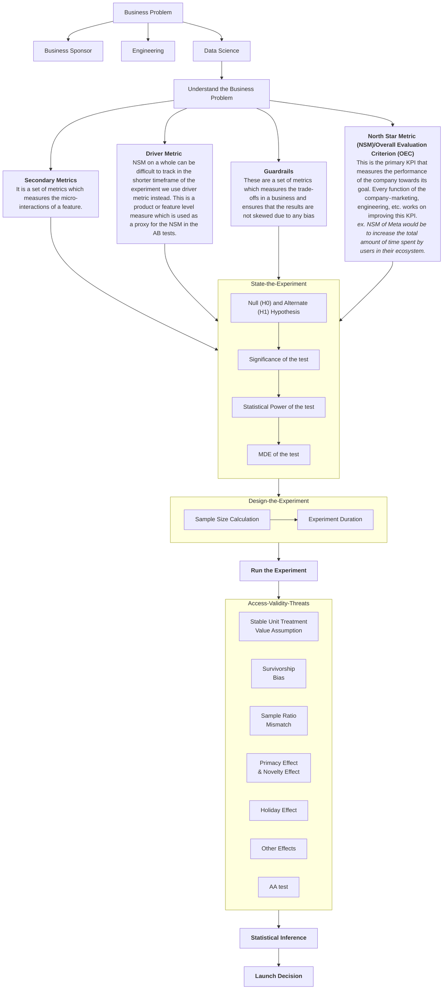

# ⚠ A/B test

```mermaid
flowchart TD
A["`Business Problem`"] --> B["`Business Sponsor`"]
A --> C["`Engineering`"]
A --> D["`Data Science`"]
D --> E["`Understand the Business Problem`"]
E --> F["`**North Star Metric (NSM)/Overall Evaluation Criterion (OEC)**
This is the primary KPI that measures the performance of the company towards its goal. Every function of the company - marketing, engineering, etc. works on improving this KPI.
*ex. NSM of Meta would be to increase the total amount of time spent by users in their ecosystem.*`"]
E --> G["`**Driver Metric** 
NSM on a whole can be difficult to track in the shorter timeframe of the experiment we use driver metric instead. This is a product or feature level measure which is used as a proxy for the NSM in the AB tests.`"]
E --> H["`**Guardrails**
These are a set of metrics which measures the trade-offs in a business and ensures that the results are not skewed due to any bias`"]
E --> I["`**Secondary Metrics**
It is a set of metrics which measures the micro-interactions of a feature.`"]

subgraph State-the-Experiment
direction TB
K["Null (H0) and Alternate (H1) Hypothesis"]
K --> L["Significance of the test"]
L --> M["Statistical Power of the test"]
M --> N["MDE of the test"]
end

subgraph Design-the-Experiment
P["Sample Size Calculation"]
P --> Q["Experiment Duration"]
end
I --> State-the-Experiment
G --> State-the-Experiment
H --> State-the-Experiment
F --> State-the-Experiment
State-the-Experiment --> Design-the-Experiment
Design-the-Experiment --> R["`**Run the Experiment**`"]

subgraph Access-Validity-Threats
Sa["Stable Unit Treatment 
Value Assumption"]
Sb["Survivorship 
Bias"]
Sc["Sample Ratio 
Mismatch"]
Sd["Primacy Effect 
& Novelty Effect"]
Se["Holiday Effect"]
Sf["Other Effects"]
Sg["AA test"]
end
R --> Access-Validity-Threats
Access-Validity-Threats --> T["`**Statistical Inference**`"]
T --> U["`**Launch Decision**`"]


```
