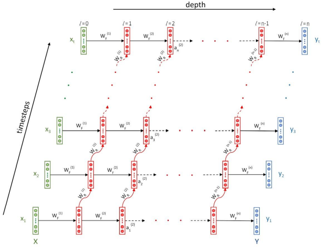
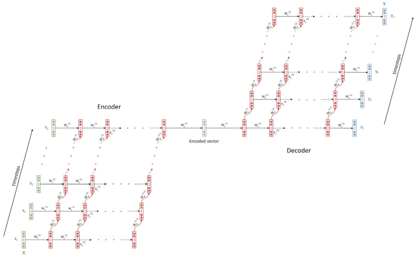
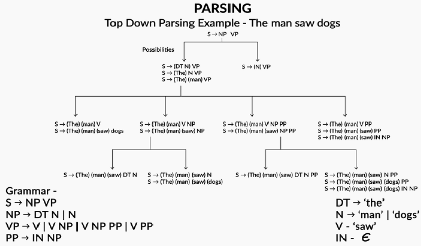

# Probability Distribution

## Random Variable

**Random Variable maps the outcome of sample space into real numbers.**

Example: How many heads when we toss 3 coins?

$$X$$ could be $$0, 1, 2$$ or $$3$$ randomly, and they might each have a different probability. $$X$$ **= "The number of Heads" is the Random Variable.**

In this case, there could be 0 Heads (if all the coins land Tails up), 1 Head, 2 Heads or 3 Heads. So, the Sample Space = $${0, 1, 2, 3}$$ But this time the outcomes are NOT all equally likely. The three coins can land in eight possible ways:

Looking at the table we see just 1 case of Three Heads, but 3 cases of Two Heads, 3 cases of One Head, and 1 case of Zero Heads. So:

* $$P(X = 3) = 1/8 = {HHH}$$
* $$P(X = 2) = 3/8 = {HHT,HTH,THH}$$
* $$P(X = 1) = 3/8 = {TTH,THT,TTH}$$
* $$P(X = 0) = 1/8 = {TTT}$$

And this is what becomes the **probability distribution.**

<figure><figcaption></figcaption></figure>

**Frequency distribution** comes from actually doing the experiment $$n$$ number of times as $$n->\infty$$ the shape comes closer and closer to the Probability distribution

Now the probability distribution can be of $$2$$ types, **discrete and continuous**. An example of Discrete is shown above.

* When we use a probability function to describe a discrete probability distribution, we call it a **probability mass function (PMF)**. The probability mass function, $$f$$, just returns the probability of the outcome. Therefore, the probability of rolling a $$3$$ is $$f(3) = 1/6$$.
* When we use a probability function to describe a continuous probability distribution, we call it a **probability density function (PDF)**.

Now depending on the problem type one can choose the corresponding distribution and find the probability for some value of the random variable.

## Types of Distribution

Some common types of probability distribution are as follows:

<figure><figcaption>
Types of Probability Distribution
</figcaption></figure>

## Normal (Gaussian) Distribution

The normal distribution is the most important probability distribution in statistics because it fits many natural phenomena. For example, heights, blood pressure, measurement error, and IQ scores follow the normal distribution.

Despite the different shapes, all forms of the normal distribution have the following characteristic properties.

* They’re all symmetric. The normal distribution cannot model skewed distributions.
* The mean, median, and mode are all equal.
* Half of the population is less than the mean and half is greater than the mean.
* The Empirical Rule, which describes the percentage of the data that fall within specific numbers of standard deviations from the mean for bell-shaped curves.

| Mean +/- standard deviations | Percentage of data contained |
| ---------------------------- | ---------------------------- |
| 1                            | 68%                          |
| 2                            | 95%                          |
| 3                            | 99.7%                        |

## Measures to understand a distribution:

There are 3 variety of measures, required to understand a distribution:

* Measure of Central tendency
* Measure of dispersion
* Measure to describe shape of curve

### Measure of Central Tendency

Measures of central tendencies are measures, which help you describe a population, through a single metric. For example, if you were to compare Saving habits of people across various nations, you will compare average Savings rate in each of these nations. Following are the measures of central tendency:

* **Mean:** or the average
* **Median:** the value, which divides the population in two half
* **Mode:** the most frequent value in a population

<figure><figcaption></figcaption></figure>

### Measure of Dispersion

Measures of dispersion reveal how is the population distributed around the measures of central tendency.

* **Range:** Difference in the maximum and minimum value in the population
* **Quartiles:** Values, which divide the population in 4 equal subsets (typically referred to as first quartile, second quartile and third quartile)
* **Inter-quartile range:** The difference in third quartile (Q3) and first quartile (Q1). By definition of quartiles, 50% of the population lies in the inter-quartile range.
* **Variance:** The average of the squared differences from the Mean.
* **Standard Deviation:** is square root of Variance

<figure><figcaption>
2 Distribution with different standard deviation
</figcaption></figure>

### Measure to describe shape of distribution

* **Skewness:** Skewness is a measure of the asymmetry. Negatively skewed curve has a long left tail and vice versa.
* **Kurtosis:** Kurtosis is a measure of the “peaked ness”. Distributions with higher peaks have positive kurtosis and vice-versa

<figure><figcaption></figcaption></figure>

### Box Plots

Box plots are one of the easiest and most intuitive way to understand distributions. They show mean, median, quartiles and Outliers on single plot.

<figure><figcaption></figcaption></figure>

## Unbiased Estimator

An unbiased estimator is an accurate statistic that’s used to approximate a population parameter. “Accurate” in this sense means that it’s neither an overestimate nor an underestimate. If an overestimate or underestimate does happen, the mean of the difference is called a “bias.” That’s just saying if the estimator (i.e., the sample mean) equals the parameter (i.e., the population mean), then it’s an unbiased estimator.

## Maximum Likelihood Estimation (MLE)

**Reference:** [Discussion](https://stats.stackexchange.com/questions/112451/maximum-likelihood-estimation-mle-in-layman-terms), [Explanation](https://www.kdnuggets.com/2019/11/probability-learning-maximum-likelihood.html), [Implementation](https://analyticsindiamag.com/maximum-likelihood-estimation-python-guide/)

Say you have some data. Say you're willing to assume that the data comes from some distribution -- perhaps Gaussian. There are an infinite number of different Gaussians that the data could have come from (which correspond to the combination of the infinite number of means and variances that a Gaussian distribution can have). MLE will pick the Gaussian (i.e., the mean and variance) that is "most consistent" with your data (the precise meaning of consistent is explained below).

So, say you've got a data set of $$y={−1,3,7}$$. The most consistent Gaussian from which that data could have come has a mean of $$3$$ and a variance of $$16$$. It could have been sampled from some other Gaussian. But one with a mean of $$3$$ and variance of $$16$$ is most consistent with the data in the following sense: the probability of getting the particular $$y$$ values you observed is greater with this choice of mean and variance, than it is with any other choice.

Maximum Likelihood Estimation can be applied to both regression and classification problems.

## Questions

[LIME] Example of unbiased estimator

What is an unbiased estimator and can you provide an example for a layman to understand?

**Answer**

One famous example of an unrepresentative sample is the literary digest voter survey, which predicted Alfred Landon would win the 1936 presidential election. The survey was biased, as it failed to include a representative sample of low income voters who were more likely to be democrat and vote for Theodore Roosevelt.

If the sampling had been done correctly then the estimator would have been unbiased as it would match with the actual output from the population, which was win for Theodore Roosevelt.

[GOOGLE] Median of Uniform Distribution

Given 3 i.i.d. variables from an uniform distribution of $$0$$ to $$4$$, what’s the chance the median is greater than $$3$$?

**Answer**

This will only be possible if atleast $$2$$ random variables are greater than $$3$$.

$$P(M>3) = P(GGL) + P(GLG) + P(LGG) + P(GGG) = 3 * (1/4)^2 * 3/4 + (1/4)^3 = 5/32$$ where, $$G$$ stands for probability of number $$> 3$$ which is probability of it being $$4$$ out of $$1,2,3,4 = 1/4$$; $$L$$ for probability of number $$< 3$$ which is probability of it being $$1,2,3$$ out of $$1,2,3,4 = 3/4$$

[SPOTIFY] MLE of Uniform Distribution

Suppose you draw n samples from a uniform distribution U(a, b). What is the MLE estimate of a and b?

**Answer**

_Solution recieved from the community via_ [_merge request_](https://github.com/dipranjan/dsinterviewqns/pull/4)

Let $$x_1, x_2, \ldots , x_n$$ be the $$n$$ samples drawn.

Recall the pdf for the uniform distribution function is:

$$f(x)=\frac{1}{b-a}$$

Thus, the likelihood function $$\mathcal{L}$$ is simply the product of the pdf n times, which is:

$$f(x)=\frac{1}{(b-a)^n}.$$

The MLE will occur at the values of $$a$$ and $$b$$ for which that quantity is maximized. Since $$(b-a)^n$$ is in the denominator, and $$b-a$$ must always be positive because $$b>a$$, the likelihood is maximized when $$b-a$$ is minimized. This means we want $$a$$ as big as possible, and $$b$$ as small as possible. But for one of the $$x_i$$ to be sampled, $$a$$ must be smaller than that value, (and $$b$$ must be larger), so the maximum likelihood estimation is $$a=\min(x_1, x_2, \ldots , x_n)$$ and $$b=\max(x_1, x_2, \ldots , x_n)$$

[MCKINSEY] Flipping 576 Times

You flip a fair coin 576 times. Without using a calculator, calculate the probability of flipping at least 312 heads.

**Answer**

Fair coin, $$p(H)=0.5$$ Since this experiment has only $$2$$ outcomes hence we can use a binomial distribution,

mean = $$np$$ = $$576*0.5 = 288$$, var= $$np(1-p)= 576*0.5*0.5 = 144$$, stddev = sqrt(var) = $$12$$.

For normal distribution, _68% of the data falls within one standard deviation, 95% percent within two standard deviations, and 99.7% within three standard deviations from the mean._

$$312= 288$$(mean)$$+2*12$$(stddev), which means the probability of flipping at least $$312$$ heads or tails is $$5%$$. Since we are only looking at the probability of at least $$321$$ heads, it is the right tail area of the distribution, which is $$5%/2= 2.5%$$. So the probability of flipping at least $$312$$ heads is $$2.5%$$.

[GOOGLE] Non-normal Probability Distribution

Explain how a probability distribution could be not normal and give an example scenario.

**Answer**

[Source](https://www.interviewquery.com/questions/non-normal-probability-distribution?ref=question\_email)

Normal probability distributions are characterized by their famous bell shaped probability density function. The observations are centered around the mean and are equally spread around as per the standard deviation of the distribution, in case the probability distribution is a standard normal. They occur frequently in the nature, for e.g. distribution of heights

There are other types of distributions which are not normal; since normal distributions are for continuous random variable, all discrete random variables do not follow normal distributions.

There can be many examples of Non-Normal distribution:

* Flip a coin ten times and count the number of heads you get. That follows a binomial distribution
* Flip a coin until you get five heads and count the number of flips. That follows a negative binomial distribution
* Take a well-shuffled deck of cards and count how many red cards there are in the first ten. That follows a hypergeometric distribution

